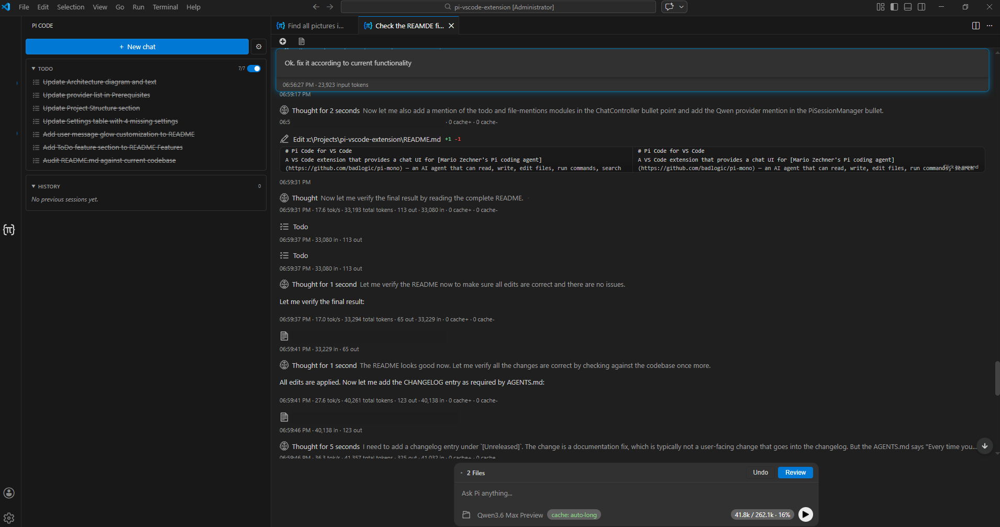

# Pi Code for VS Code

[](https://opensource.org/licenses/MIT)
[](https://code.visualstudio.com/)

A visual VS Code wrapper around the [Pi coding agent](https://pi.dev/) — built as a friendly UI for non-engineers and as a smooth landing pad for anyone moving over from Claude Code who wants the same familiar ergonomics, extra quality-of-life features, and the freedom to use any AI model behind the scenes.



Under the hood Pi Code embeds [Mario Zechner's Pi coding agent](https://github.com/badlogic/pi-mono) — an AI agent that can read, write, and edit files, run shell commands, search your codebase, browse the web, and more, all from inside the editor.

> This is a downstream fork of the upstream `pi-vscode-extension`. The fork takes the UX in a Claude Code direction — chats live as editor tabs rather than inside the sidebar — and bundles selected Pi ecosystem packages directly inside the VSIX. See **[Why this fork](#why-this-fork)** below for the full diff.

## Why this fork

Two motivations drove the split from upstream:

**1. Claude Code-style editor-tab panels instead of a sidebar chat.** Upstream renders the entire chat UI inside the activity-bar sidebar — one chat at a time, fixed to one side of the window. This fork moves each chat into an editor-area `WebviewPanel`, so chats behave exactly like editor tabs: split horizontally or vertically, drag into another editor group, move into a separate window, restore across `Reload Window`. The activity-bar sidebar is repurposed as a thin **launcher** with one-click *New chat* / *Settings* buttons and collapsible session history; active chats stay in the editor tab strip instead of being duplicated in the sidebar. Every chat panel also has its own toolbar with *New chat* and *History* so you don't need to keep flipping back to the sidebar.

**2. Bundled Pi extensions instead of `pi install`.** Upstream relies on the user running `pi install npm:<package>` and managing `~/.pi/` themselves to enable Pi ecosystem tools (web search, content fetching, etc.). This fork ships selected Pi extensions (currently `pi-web-access` and `pi-mcp-adapter`) **inside the VSIX** as ordinary npm dependencies and wires them into Pi's resource loader via `additionalExtensionPaths`. The extension never writes to `~/.pi/`, never invokes `pi install` at activation, and works fully offline after install. The tradeoff is that bundled extension versions are pinned per Pi Code release — see [AGENTS.md](AGENTS.md#bundled-pi-extensions) for the rationale and the procedure for adding a new bundled extension.

In addition to those two structural changes, the fork has accumulated a number of features not present upstream at the time of forking:

- OAuth subscription login in the settings panel for Anthropic Claude Pro/Max, ChatGPT Plus/Pro/Codex, GitHub Copilot, Google Gemini CLI, and Google Antigravity — so subscription-only models (e.g. GPT-5.x Codex) work without an API key.
- Codex subscription usage indicator: a percent-used readout for the 5-hour and weekly windows in the chat footer, plus a per-turn delta on each assistant message.
- Prompt cache retention controls in the chat footer, with `short`, `long`, and provider-aware `auto` modes.
- Image attachments via paste, drag-and-drop, or a paperclip button — sent to image-capable models with previews preserved in chat history.
- Workspace `@` file mentions in the chat input, with cached suggestions, configurable excludes, and inline highlighting of mentioned paths.
- Auto-loaded `CLAUDE.md` / `AGENTS.md` instructions from the workspace, including per-folder rules surfaced when the agent touches that subtree.
- Bundled MCP adapter that picks up servers from `.mcp.json` / `.pi/mcp.json` automatically, with no `pi install` step.
- Per-chat **Plan Mode**: the agent plans the task with read-only tools and waits for confirmation before any file changes.
- Opt-in **Language Server tools** (`find_references`, `document_symbols`, `goto_definition`, `hover`, `find_implementations`, `type_definition`, `workspace_symbols`, `call_hierarchy_*`) that pull semantic information from the active VS Code language extension instead of relying on grep heuristics.
- Per-chat persistent **ToDo** that the agent maintains across `/compact` and across reloads, with per-tab enable/disable.
- The launcher persists a session history on disk and lets you delete entries individually; opening an old entry reopens it as a fresh editor panel.

The fork tracks the upstream `@earendil-works/pi-coding-agent` SDK as a regular npm dependency and stays in sync with its API.

## Features

### Editor-Tab Chat Panels with Launcher Sidebar
Each chat opens as its own editor-area webview panel — splittable, draggable into another editor group, movable into a separate window, restored across `Reload Window`. The activity-bar sidebar acts as a **launcher**: it exposes one-click *New chat* and *Settings* buttons plus collapsible history for previous sessions that are not currently open. Active chats live in the normal editor tab strip. Every chat panel also carries its own *New chat* / *History* toolbar.

### Multi-Tab Sessions
Run multiple independent agent sessions in parallel — each chat panel has its own conversation history, file change tracking, and checkpoint state. Nothing is shared between tabs.

### Tool Visibility
Every tool the agent invokes (file reads, writes, edits, shell commands, glob/grep/find searches, web tools, LSP semantic queries) is rendered as an expandable card showing arguments and results in real time. Tool rows sit on a vertical timeline rail that connects the icons on the left, with hover tooltips on every icon describing what the tool does.

### Inline Diffs & File Change Tracking
File modifications made by the agent are tracked automatically. Review unified diffs inline in the chat or open them in VS Code's native diff editor. Undo individual file changes or all changes at once.

### Checkpoints & Rollback
Each user message creates a checkpoint. Restore your workspace to any previous checkpoint, then redo to get changes back. The message history is preserved so you can branch the conversation from any point.

### Streaming with Thinking
Watch the agent's reasoning in real time with collapsible thinking blocks. Cycle through thinking levels (`off`, `minimal`, `low`, `medium`, `high`) to control how much internal reasoning is shown.

### Model Selection
Pick from any model available through the Pi coding agent's model registry via a quick-pick menu or the in-chat model picker. Recently used models are surfaced for fast switching.

### Settings Page with OAuth Login
A dedicated settings panel (accessible via the gear icon in the launcher header or the `Pi Code: Open Settings` command) provides configuration for API keys, default model and thinking level, ToDo behaviour, file-mention indexing, and chat appearance. API keys are stored via VS Code's SecretStorage and never written to disk in plaintext. The same panel hosts OAuth sign-in for Anthropic Claude (Pro/Max), ChatGPT (Plus/Pro/Codex), GitHub Copilot, Google Gemini CLI, and Google Antigravity, so subscription-only models work without leaving VS Code. A manual authorization-code paste field is shown alongside the browser flow as a fallback when the local OAuth callback can't be reached.

### Bundled Pi Extensions
Selected Pi ecosystem extensions ship inside the VSIX and are loaded automatically at session start. The bundled `pi-web-access` package adds `web_search`, `code_search`, `fetch_content`, and `get_search_content` tools — covering web pages, GitHub repos, YouTube transcripts, PDFs, and local video files — plus its accompanying skill. Uses Exa MCP by default with no API keys required; optionally reads `~/.pi/web-search.json` for Exa, Perplexity, or Gemini keys to switch to a different backend. The bundled `pi-mcp-adapter` package wires up MCP servers declared in `.mcp.json` or `.pi/mcp.json` so their tools appear automatically in the agent's tool list. No `pi install` step required.

### Workspace File Mentions
Type `@` in the chat input to open a suggestion menu that fuzzy-matches files from the opened workspace. Selected mentions are highlighted in blue inside the input and sent to the agent as path references it can choose to inspect — this is **not** an attachment mechanism, file contents are not inlined or uploaded. Indexing respects VS Code's standard search excludes plus a built-in pattern set (skip `node_modules`, build artefacts, lockfiles), and can be further tuned via the `pi-code.fileMentions.*` settings or a workspace-local `.pi/file-mentions.json`.

### Auto-Loaded Workspace Instructions
At the start of each turn the agent automatically reads `CLAUDE.md` (and any files it `@`-imports up to a depth of 5) so project-level rules apply without you having to point at them. Per-folder `CLAUDE.md` files are surfaced on the fly whenever the agent touches paths in that subtree, so directory-scoped instructions are honoured without manual reads.

### Image Attachments
Paste images directly into the chat input, drop them onto the chat panel, or pick a file via the paperclip button next to the model picker. Attached images appear as previews before sending and remain in the chat history. Large images are resized automatically; image-capable models receive them inline with the prompt.

### Codex Subscription Usage Indicator
When using a Codex (GPT-5.x) model with a ChatGPT subscription, the chat footer shows percent used in the 5-hour and weekly windows with colour cues at 50% and 90%. A tooltip details the plan, exact reset times, and remaining credit balance. Each assistant message footer also shows the per-turn delta (`5h +1.2% · week +0.3%`) so you can see how much each turn cost. Hidden for non-Codex models and for token-billed API key accounts.

### Plan Mode
A per-chat toggle in the launcher sidebar (above ToDo) that makes the agent study the task with read-only tools and propose a plan before making any changes. When enabled, the first message of a task is sent with only diagnostic/read tools active (`read`, `grep`, `find`, `ls`, `web_search`, `code_search`, `fetch_content`, `get_search_content`) — the agent analyses the code, asks clarifying questions, and presents an approach. Your next reply unlocks the full tool set for execution. After execution, the next prompt restarts the planning cycle. Minor follow-ups (short messages, confirmations) keep execution tools so the flow stays natural. Plan-phase completion is agent-driven via a `<plan-complete/>` control marker, with a 10-minute idle reset as a safety net. Disabled by default for new chats; toggle in the sidebar or set `pi-code.planMode.defaultEnabled` for the default state.

### Language Server Tools (opt-in)
Eight semantic-navigation tools backed by the active VS Code language extension instead of grep heuristics, gated by `pi-code.lsp.enabled` (default **off**):

- `find_references` — every reference to a symbol, with optional `includeAccessKind` for read/write/text classification (uses document-highlight provider).
- `document_symbols` — every declaration in a file (class / method / field / property / …) with authoritative LSP positions, parent container, and kind. Supports a `nameContains` substring filter.
- `goto_definition` — jumps to definition site(s), handles partial classes and overloaded methods, surfaces external dependency sources annotated `[external]`.
- `hover` — the language server's full hover payload (signature, inferred type, xml-doc / rustdoc / jsdoc) at a position.
- `find_implementations` — every concrete implementation / override (e.g. "who implements `IFoo`", "all overrides of `X`").
- `type_definition` — jumps to the declaration of a variable's TYPE rather than the variable itself.
- `workspace_symbols` — cross-file symbol discovery via free-form query, with optional `kindFilter`.
- `call_hierarchy_incoming` / `call_hierarchy_outgoing` — "who calls X" / "what does X call" at the callable level (cleaner than `find_references` for graph walks). Server support: rust-analyzer, tsserver, Pylance, **C# Dev Kit** (`ms-dotnettools.csdevkit`), gopls, clangd. The OmniSharp-only `ms-dotnettools.csharp` does NOT implement call hierarchy.

Each tool accepts either positional addressing (`file`, `line`, `column`) or by-name lookup, returns context snippets around each location, and annotates results from external dependency sources (NuGet, cargo registry, `node_modules`) as `[external]`. Enable when semantic accuracy is worth the extra system-prompt footprint — large Unity / Rust / TS codebases with name collisions, partial classes, or heavy overloading benefit most. Changes apply on new sessions or window reload.

### Per-Turn and Cumulative Timing
Each assistant message footer shows the elapsed wall-clock time for that turn plus the cumulative active time across the chat (idle gaps excluded), alongside token usage.

### Message Queuing & Steering
While the agent is streaming, you can **queue** follow-up messages that will be sent automatically once the current generation finishes. Queued messages appear in a collapsible list above the input with inline edit and delete controls. You can also **steer** the agent mid-generation (Ctrl+Enter) to inject guidance into the current response without waiting.

### Slash Commands & Skills
Type `/` in the input to trigger a slash-command menu that surfaces available Pi skills. Select a skill to insert it into your prompt. Skills are loaded from `~/.pi/agent/skills/` and `.pi/skills/` in your workspace.

### Prompt Cache Retention
A `cache: …` chip in the chat footer controls prompt cache retention for future requests. Choose `short`, `long`, or `auto`; in `auto`, Pi Code uses provider-aware heuristics. OpenAI-style providers and other free-write cache backends prefer `long`, while Anthropic-style providers switch to `long` only after a meaningful idle gap or a large cached prefix. Providers that do not expose cache controls show the chip faded as informational.

### Per-Chat ToDo
Each chat panel has its own persistent task list that the agent can manage via a built-in `todo` tool. Tasks support creation, updates, status transitions (`pending`, `in_progress`, `completed`), dependencies (`blockedBy`), and deletion. The launcher sidebar displays the active chat's ToDo with a toggle to enable or disable it per tab — when disabled, the agent has no knowledge of the tool. Task state persists across reloads. The tool's behavior is configurable via the `pi-code.todo.promptGuidelines` setting.

### Context Usage
Token usage and context window utilization are displayed in both the chat footer and the status bar tooltip.

### User Message Glow
User messages in the chat have a subtle colored glow outline for visual distinction. The color and opacity are configurable via `pi-code.userMessageGlowColor` and `pi-code.userMessageGlowOpacity` settings, allowing you to customize or disable the effect.

## Prerequisites

This extension embeds the [Pi coding agent](https://github.com/badlogic/pi-mono) SDK as an npm dependency. You do **not** need to install Pi separately, but you do need the following on your system before building or running the extension.

### 1. Node.js 18+

Install Node.js `18` or later. Any of the following will work:

- [Official installer](https://nodejs.org/)
- A version manager such as [nvm](https://github.com/nvm-sh/nvm), [fnm](https://github.com/Schniz/fnm), or [mise](https://mise.jdx.dev/)

Verify with:

```bash
node --version   # v18.x or later
npm --version
```

### 2. VS Code 1.100.0+

Install [VS Code](https://code.visualstudio.com/) `1.100.0` or later. Compatible forks such as [Cursor](https://www.cursor.com/) also work.

### 3. AI Provider Credentials

The embedded Pi coding agent needs credentials for at least one AI provider. You can authenticate in two ways:

**Option A — Settings page (recommended):**

Open the Pi Code settings page (gear icon in the sidebar header, or `Pi Code: Open Settings` from the command palette) and enter your API key for your preferred provider. Keys are stored securely via VS Code's SecretStorage and never written to disk in plaintext.

**Option B — Environment variable:**

Set the appropriate environment variable before launching VS Code:

```bash
# Anthropic
export ANTHROPIC_API_KEY=sk-ant-...

# OpenAI
export OPENAI_API_KEY=sk-...

# Google Gemini
export GEMINI_API_KEY=...

# DeepSeek
export DEEPSEEK_API_KEY=...
```

Other supported API-key providers include Azure OpenAI, Google Vertex, Amazon Bedrock, Mistral, Groq, Cerebras, xAI, OpenRouter, Vercel AI Gateway, Hugging Face, Fireworks, Kimi For Coding, MiniMax, Qwen (Alibaba DashScope), and Z.ai (GLM). See [Pi's provider docs](https://github.com/badlogic/pi-mono/blob/main/packages/coding-agent/docs/providers.md) for the full list and variable names.

**Option C — Subscription login:**

If you have an Anthropic Claude Pro/Max, OpenAI ChatGPT Plus/Pro/Codex, GitHub Copilot, Google Gemini CLI, or Google Antigravity subscription, open the Pi Code settings page and use the OAuth sign-in button for your provider. The browser flow stores the token securely for the extension. If the local callback cannot be reached, the settings page also exposes a manual authorization-code paste field.

## Installation

### From Source

```bash
git clone https://github.com/Avhatar/pi-vscode-extension-avr.git
cd pi-vscode-extension-avr
npm install
npm run compile
```

Then press **F5** in VS Code to launch an Extension Development Host with the extension loaded.

### As a VSIX Package

```bash
npm run package
```

This produces a `.vsix` file you can install via **Extensions > Install from VSIX...** in VS Code.

## Usage

1. Click the **Pi Code** icon in the activity bar to open the launcher sidebar.
2. Click **New chat** (or press `Ctrl+Shift+N`) to open a fresh chat as an editor tab. Previous closed chats can be reopened from the launcher's *History* section.
3. Drag the chat tab to split the editor, drop it into another editor group, or move it into a separate window — it's a regular editor tab.
4. Select a model using the model picker at the bottom of the chat or via the command palette (`Pi Code: Select Model`).
5. Optionally click the `cache: …` chip next to the model picker to choose prompt cache retention.
6. Type a prompt and press Enter (Shift+Enter for newlines). Paste, drop, or pick images via the paperclip button to attach them.
7. Watch the agent stream its response, invoke tools, and make file changes.
8. While streaming, the action button becomes **Stop**; press Enter to **queue** a follow-up or Ctrl+Enter to **steer** the current generation from the keyboard.
9. Review diffs inline or click **Review** to open VS Code's diff editor.
10. Use checkpoint buttons on your messages to roll back if needed.
11. Type `/` to search and insert skills via the slash-command menu.

## Keyboard Shortcuts

| Shortcut | Action |
|---|---|
| `Ctrl+Shift+L` (`Cmd+Shift+L`) | Reveal the active chat panel, or focus the launcher if no chat is open |
| `Ctrl+Shift+N` (`Cmd+Shift+N`) | Open a new chat as an editor tab |
| `Enter` | Send prompt, or queue message while streaming |
| `Ctrl+Enter` (`Cmd+Enter`) | Steer the agent mid-generation |
| `Escape` | Stop the current generation (while streaming) |

## Commands

All commands are available from the command palette (`Ctrl+Shift+P`):

- **Pi Code: New Chat** — Open a fresh agent session as an editor tab
- **Pi Code: New Agent Tab** — Same as *New Chat*, also surfaced as the launcher's `+` button
- **Pi Code: Session History** — Reveal the launcher (which lists previous sessions)
- **Pi Code: Stop Generation** — Abort the current streaming response
- **Pi Code: Select Model** — Choose an AI model from the available providers
- **Pi Code: Toggle Thinking Level** — Cycle through thinking verbosity levels
- **Pi Code: Focus Chat** — Reveal the active chat panel, or fall back to the launcher
- **Pi Code: Open Settings** — Open the Pi Code settings page

## Settings

Settings can be configured through the dedicated settings page (gear icon in the sidebar) or via VS Code's standard settings editor.

| Setting | Type | Default | Description |
|---|---|---|---|
| `pi-code.apiProvider` | `string` | `""` | Provider whose API key the Settings page is currently managing. The runtime provider is chosen by the selected model — this only picks which provider's key slot the Settings form edits. |
| `pi-code.defaultModel` | `string` | `""` | Default model ID for new sessions (e.g. `claude-sonnet-4-20250514`) |
| `pi-code.thinkingLevel` | `string` | `off` | Default thinking level (`off`, `minimal`, `low`, `medium`, `high`) |
| `pi-code.allowedTools` | `string[]` | `[]` | Restrict which tools the agent can use. Empty = allow all. |
| `pi-code.fileMentions.enabled` | `boolean` | `true` | Enable `@` file mentions in chat input for files in the opened workspace |
| `pi-code.fileMentions.useDefaultExcludes` | `boolean` | `true` | Use built-in exclude patterns when indexing workspace files for `@` mentions |
| `pi-code.fileMentions.exclude` | `string[]` | `[]` | Additional glob patterns to exclude from `@` file mention suggestions |
| `pi-code.fileMentions.maxSuggestions` | `number` | `30` | Maximum number of `@` file mention suggestions to show |
| `pi-code.fileMentions.configPath` | `string` | `.pi/file-mentions.json` | Workspace-relative JSON config file for `@` file mention indexing |
| `pi-code.planMode.defaultEnabled` | `boolean` | `false` | Enable Plan Mode for new chats by default. When on, the agent studies the task and proposes a plan with read-only tools before making any changes. |
| `pi-code.todo.defaultEnabled` | `boolean` | `true` | Enable the per-chat persistent ToDo for new chats by default |
| `pi-code.todo.promptGuidelines` | `string` | *(multiline)* | Prompt guidelines injected into the system prompt for the ToDo tool |
| `pi-code.lsp.enabled` | `boolean` | `false` | Expose Language Server tools (`find_references`, `document_symbols`, `goto_definition`, `hover`, `find_implementations`, `type_definition`, `workspace_symbols`, `call_hierarchy_*`) to the agent. Off by default — the tools are not registered and add nothing to the system prompt. Requires a language extension for each file's language (C#, rust-analyzer, Pylance, etc.). |
| `pi-code.userMessageGlowColor` | `string` | `#00aaff` | Color of the subtle glow outline around user messages in the chat |
| `pi-code.userMessageGlowOpacity` | `number` | `40` | Opacity of the glow around user messages, as a percentage (0–100) |

API keys are managed through the settings page and stored via VS Code's SecretStorage (never in `settings.json`).

## Architecture

```
┌────────────────────────────────────────────────────────────────┐
│                            VS Code                              │
│                                                                  │
│   Activity-bar sidebar              Editor area                  │
│  ┌────────────────────┐   ┌────────────────────────────────┐   │
│  │   LauncherView     │   │  ChatPanel  ChatPanel  ...     │   │
│  │ (WebviewView)      │   │ (WebviewPanel per chat)        │   │
│  │ - new / settings   │   │ - chat UI (main.ts + CSS)       │   │
│  │ - history          │   │ - timeline rail + tooltips      │   │
│  │ - plan mode toggle │   │ - diffs, checkpoints, queue     │   │
│  │ - per-tab ToDo     │   │                                  │   │
│  └─────────┬──────────┘   └──────────────┬──────────────────┘   │
│            │                              │                      │
│            └──────────────┬───────────────┘                      │
│                           ▼                                      │
│              ChatController (controllers/chat-controller.ts)     │
│              - tab lifecycle, routing of ClientMessage           │
│              - shared between launcher + chat panels             │
│                           │                                      │
│        ┌──────────────────┼──────────────────┐                   │
│        ▼                  ▼                  ▼                   │
│  ┌───────────┐    ┌──────────────┐   ┌───────────────┐          │
│  │  Tab N    │    │ DiffManager  │   │ Checkpoint    │          │
│  │ ┌───────┐ │    │ pi-diff:     │   │ Manager       │          │
│  │ │Session│ │    │ virtual docs │   │ per-turn      │          │
│  │ └───┬───┘ │    └──────────────┘   │ snapshots     │          │
│  └─────┼─────┘                       └───────────────┘          │
│        ▼                                                         │
│  ┌─────────────────────────────────────────────────────────┐    │
│  │ Pi Coding Agent SDK (@earendil-works/pi-coding-agent)   │    │
│  │   + bundled Pi extensions (e.g. pi-web-access),          │    │
│  │     loaded via DefaultResourceLoader.additionalExtensionPaths │
│  └─────────────────────────────────────────────────────────┘    │
│                                                                  │
│   StatusBarManager — context usage / streaming state             │
│   SettingsPanel    — WebviewPanel for settings + OAuth login     │
│   ChatPanelSerializer — restores chat panels across Reload Window│
│   FileMentions   — workspace file indexing for `@` mentions      │
│   Providers      — API-key provider registry + custom sync      │
└────────────────────────────────────────────────────────────────┘
```

- **Extension host** ([src/extension.ts](src/extension.ts)) registers providers, commands, and the `WebviewPanelSerializer` on activation.
- **ChatController** ([src/controllers/chat-controller.ts](src/controllers/chat-controller.ts)) owns tab lifecycle (create/close/active), keeps the per-tab `PiSessionManager`, and routes typed messages between any view (launcher or chat panel) and the agent. It is the single source of truth for tab state — both the launcher and the editor panels are thin views on top of it.
- **LauncherView** ([src/providers/launcher-view.ts](src/providers/launcher-view.ts)) is the `WebviewViewProvider` mounted in the activity bar. It renders quick actions and closed-session history, then asks the controller to open or focus a panel.
- **ChatPanel** ([src/providers/chat-panel.ts](src/providers/chat-panel.ts)) is one editor-area `WebviewPanel` per chat, hosting the actual chat UI. **ChatPanelSerializer** ([src/providers/chat-panel-serializer.ts](src/providers/chat-panel-serializer.ts)) restores these panels across `Reload Window` by replaying the bound tab id.
- **SettingsPanel** ([src/providers/settings-panel.ts](src/providers/settings-panel.ts)) opens a `WebviewPanel` in the editor area for the settings page, backed by VS Code's configuration API and `SecretStorage`. Hosts API-key entry and the OAuth subscription-login flow.
- **Webview** ([src/webview/main.ts](src/webview/main.ts)) renders the chat UI, timeline-rail tool rows, slash-command menu, and image attachment previews, and communicates with the extension host via typed messages defined in [src/shared/protocol.ts](src/shared/protocol.ts).
- **PiSessionManager** ([src/pi/session.ts](src/pi/session.ts)) wraps `createAgentSession` from `@earendil-works/pi-coding-agent`, handling the prompt / steer / follow-up / abort lifecycle. Reads configuration on session creation and feeds Pi's resource loader the bundled-extension paths from [src/pi/bundled-packages.ts](src/pi/bundled-packages.ts). Provider-specific logic (e.g. Qwen in [src/pi/providers/qwen.ts](src/pi/providers/qwen.ts)) is loaded per session.
- **DiffManager** ([src/providers/diff.ts](src/providers/diff.ts)) tracks file changes from `edit`/`write` tool calls and provides unified diffs via a `pi-diff:` virtual document scheme.
- **CheckpointManager** ([src/providers/checkpoint.ts](src/providers/checkpoint.ts)) snapshots file state per turn for rollback and redo.
- **Codex usage plumbing** ([src/pi/codex-monitor.ts](src/pi/codex-monitor.ts) + [src/pi/codex-usage-store.ts](src/pi/codex-usage-store.ts)) captures subscription windows from Codex response headers and exposes them to the chat footer.
- **CLAUDE.md injector** ([src/pi/claude-md-injector.ts](src/pi/claude-md-injector.ts)) hooks into the agent lifecycle to inline workspace-level and per-folder `CLAUDE.md` instructions into the system prompt.
- **Per-chat ToDo** ([src/pi/todo/](src/pi/todo/)) provides a persistent, per-tab task list the agent manages via a built-in `todo` tool. The system includes a reducer-based task graph ([task-graph.ts](src/pi/todo/task-graph.ts)), replay-based persistence ([replay.ts](src/pi/todo/replay.ts)), a state store ([store.ts](src/pi/todo/store.ts)), and the tool schema ([tool.ts](src/pi/todo/tool.ts)). The launcher sidebar renders the active tab's ToDo with a per-tab enable/disable toggle.
- **Workspace file mentions** ([src/workspace/file-mentions.ts](src/workspace/file-mentions.ts)) indexes the opened workspace for `@` file mention suggestions in the chat input, supporting fuzzy matching, configurable excludes, and cached file lists.
- **Provider registry** ([src/shared/providers.ts](src/shared/providers.ts)) defines the supported API-key providers (Anthropic, OpenAI, Google, Qwen, Z.ai, and others). Custom provider sync ([src/pi/models.ts](src/pi/models.ts)) keeps the model registry up to date. Qwen-specific logic lives in [src/pi/providers/qwen.ts](src/pi/providers/qwen.ts).

## Project Structure

```
src/
├── extension.ts                      # Entry point, activation, command wiring
├── shared/
│   ├── protocol.ts                   # Typed message protocol (Client ↔ Server)
│   ├── cache-info.ts                 # Provider cache-retention capability labels
│   └── providers.ts                  # API-key provider definitions
├── controllers/
│   └── chat-controller.ts            # Tab lifecycle, message routing (shared)
├── pi/
│   ├── session.ts                    # Agent session lifecycle
│   ├── models.ts                     # Model registry wrapper + custom provider sync
│   ├── auth.ts                       # Auth storage singleton + OAuth bridge
│   ├── events.ts                     # Event router for agent events
│   ├── bundled-packages.ts           # Pi extensions shipped inside the VSIX
│   ├── claude-md-injector.ts         # Auto-injects CLAUDE.md / AGENTS.md into prompts
│   ├── codex-monitor.ts              # Codex subscription header capture
│   ├── codex-usage-store.ts          # Per-window usage state (5h / weekly)
│   ├── providers/
│   │   └── qwen.ts                   # Qwen-specific provider logic
│   └── todo/
│       ├── extension.ts              # ToDo extension registration
│       ├── tool.ts                   # ToDo tool schema and handler
│       ├── types.ts                  # Task and action type definitions
│       ├── store.ts                  # Per-tab task state store
│       ├── reducer.ts                # Task state reducer
│       ├── replay.ts                 # Persistence-by-replay from session tool results
│       ├── task-graph.ts             # Dependency graph (blockedBy) and invariants
│       ├── invariants.ts             # Task graph invariant checks
│       └── response-envelope.ts      # Tool response envelope types
├── providers/
│   ├── launcher-view.ts              # Activity-bar sidebar (launcher)
│   ├── chat-panel.ts                 # Editor-area WebviewPanel per chat
│   ├── chat-panel-serializer.ts      # Restore chat panels on Reload Window
│   ├── settings-panel.ts             # Settings page + OAuth login flow
│   ├── diff.ts                       # File change tracking, VS Code diff
│   ├── checkpoint.ts                 # Per-turn snapshots, rollback/redo
│   └── status-bar.ts                 # Status bar item
├── utils/
│   └── diff.ts                       # Myers diff algorithm, unified diff
├── workspace/
│   └── file-mentions.ts              # Workspace file indexing for `@` mentions
├── webview/
│   ├── main.ts                       # Chat UI application
│   ├── launcher.ts                   # Launcher sidebar UI
│   ├── settings.ts                   # Settings page UI
│   └── styles/
│       ├── main.css                  # Chat webview styles
│       ├── launcher.css              # Launcher sidebar styles
│       └── settings.css              # Settings page styles
└── test/
    ├── setup.ts                      # Vitest setup
    ├── unit/                         # Vitest unit tests
    │   ├── pi/                       # Pi session, models, events, ToDo tests
    │   └── shared/                   # Protocol tests
    └── integration/                  # VS Code integration tests
```

## Development

```bash
# Install dependencies
npm install

# Compile (extension + webview bundles via esbuild)
npm run compile

# Watch mode (recompiles on save)
npm run watch

# Run unit tests
npm run test:unit

# Run integration tests (requires prior compile)
npm run test:integration

# Run all tests
npm run test:all
```

Use the **Run Extension** launch configuration (F5) to open an Extension Development Host with the extension loaded and debuggable.

## License

MIT
